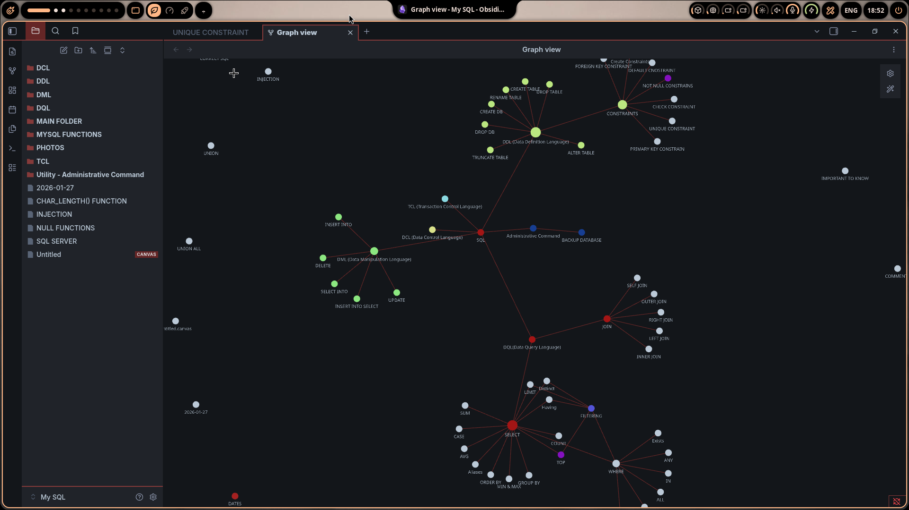

# 🗄️ MySQL Master Vault
> A comprehensive knowledge base for MySQL, optimized for **Obsidian**.

This repository serves as my "Second Brain" for **MySQL**. The notes are stored in a dedicated vault folder for better organization.

---

## 🏗️ Vault Structure
| Category | Description | Key Topics |
| :--- | :--- | :--- |
| **DDL** | Data Definition | Schemas, Tables, Altering structures |
| **DML** | Data Manipulation | Adding, Updating, and Deleting data |
| **DQL** | Data Querying | Complex SELECTs, Joins, and Filtering |

---

## 📚 Table of Contents

### 🛠️ DDL (Definition)
* [CREATE DB & TABLE](MySQL-Vault/DDL/CREATE%20DB.md)
* [ALTER TABLE](MySQL-Vault/DDL/ALTER%20TABLE.md)
* [Constraints](MySQL-Vault/DDL/CONSTRAINTS/CONSTRAINTS.md)
* [DROP & RENAME](MySQL-Vault/DDL/DROP%20TABLE.md)

### ✍️ DML & DQL (Manipulation & Query)
* [INSERT](MySQL-Vault/DML/INSERT%20INTO.md) | [UPDATE](MySQL-Vault/DML/UPDATE.md) | [DELETE](MySQL-Vault/DML/DELETE.md)
* [SELECT](MySQL-Vault/DQL/SELECT/SELECT.md) | [JOINs](MySQL-Vault/DQL/JOIN/JOIN.md) | [WHERE](MySQL-Vault/DQL/WHERE/WHERE.md)

### ⚙️ Admin & Functions
* [TCL Commands](MySQL-Vault/TCL/TCL%20(Transaction%20Control%20Language).md)
* [BACKUP](MySQL-Vault/Utility%20-%20Administrative%20Command/BACKUP%20DATABASE.md)
* [Functions](MySQL-Vault/MYSQL%20FUNCTIONS/STRING%20FUNCTIONS/STRING%20FUNCTIONS.md)

---

## 🖼️ Visual References
📁 **[View Photos Directory](MySQL-Vault/PHOTOS/)**

---

## 🚀 Getting Started
1. **Clone the Repository:**
   `git clone https://github.com/AhmadHasSwag/mysql-knowledge-base.git`
2. **Open in Obsidian:**
   - Open Obsidian App.
   - Click "Open folder as vault".
   - **Important:** Select the `MySQL-Vault` folder specifically.
3. **Graph View:**
   - Use the **Graph View** inside Obsidian to see how topics interlink!
   - ### 📸 Preview

---
*Created with ❤️ by [Ahmad](https://github.com/AhmadHasSwag)*
